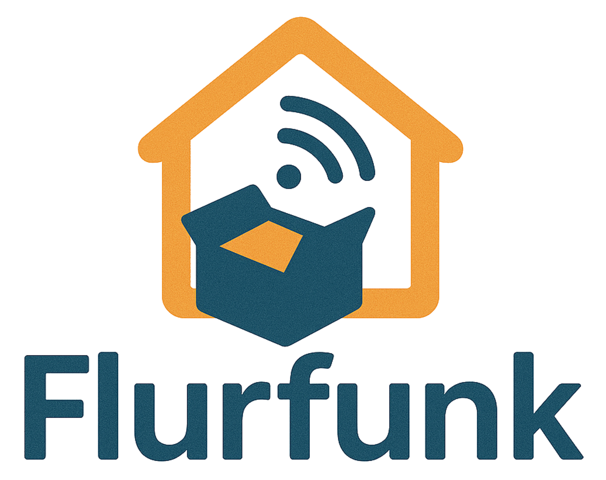

# Flurfunk

**Flurfunk** is a distributed Android application for hyperlocal communication and bartering, intended for use within residential buildings. It enables residents to share and browse classified offers (e.g., furniture, electronics, books) via a decentralized mesh network using LoRa technology — completely offline and without internet access.

---

  

---

## Features

- **Neighborhood-Only Visibility**: Offers are only visible to residents in the same building (based on address).
- **Classified Listings**: Post and browse offers in categories such as:
    - Electronics
    - Furniture
    - Books
    - Household
    - Tools
    - Clothing
- **LoRa Synchronization**: Offers and peer profiles are exchanged via LoRa broadcast using encrypted messages.
- **Profile Management**: Create and manage your own profile with optional contact info.
- **Secure Transmission**: End-to-end encryption using AES/CTR based on shared mesh ID.
- **Offline-First Architecture**: No central server or cloud dependency — everything is local and peer-to-peer.

---

## Technology Stack

- **Platform**: Android (Java)
- **Networking**: [LoRa USB dongles (Waveshare)](https://www.waveshare.com/wiki/USB-TO-LoRa-xF)
- **UI**: Android Jetpack, Navigation Component, ViewBinding
- **Local Storage**: SharedPreferences + JSON persistence
- **Encryption**: AES-128 CTR with SHA-256 derived keys
- **Testing**: JUnit + Robolectric + Mockito

---

## License

This project is licensed under the MIT License — see the [LICENSE](LICENSE) file for details.
